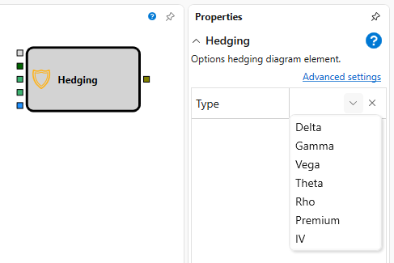

# Hedging

The cube is used to hedging the position on options.

### Incoming sockets

Incoming sockets

- **Model** – the calculation model (for example, Black-Scholes).
- **Instrument** – the instrument, the underlying asset.
- **Volume** \- the numerical value of the volume.
- **Position by underlying asset** – the position by the underlying asset.
- **Flag** – the signal (flag) that initiates the hedging process.

### Outgoing sockets

Outgoing sockets

- **Order** – the registered order that can be used to obtain trades on it by using the Trades element by the order and displaying it on the chart using the Chart panel cube

### Parameters

Parameters

- **Hedging type** \- the hedging type, it can take the values of Delta, Gamma, Vega, Theta, Po.

## Recommended content

[Options quoting](Designer_Quoting.md)
