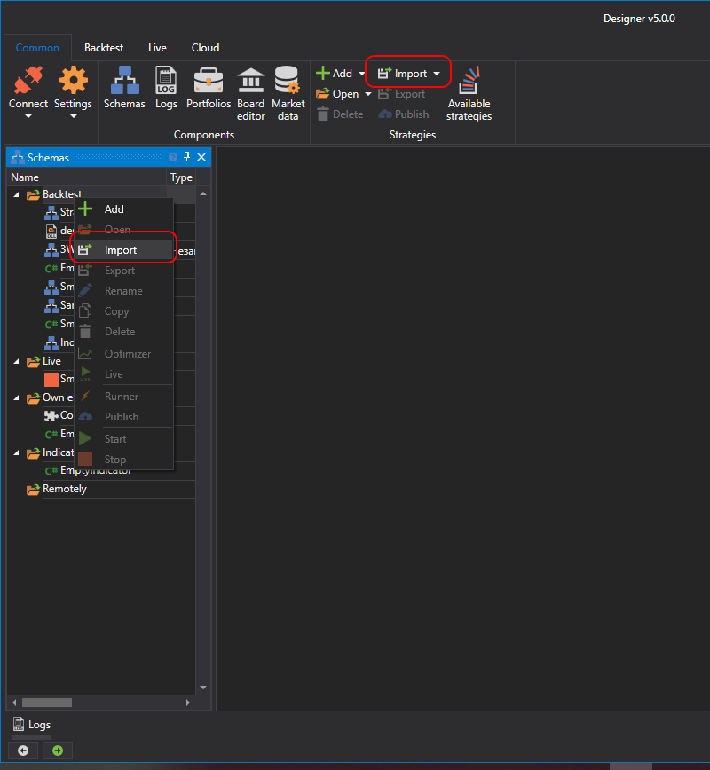
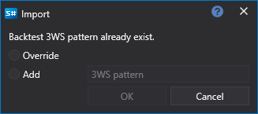

# Import

The Designer allows you to import any type of data: strategies, blocks, and indicators. There are several ways to import:

- In the **Schemes** panel, right-click on the strategy folder, and in the menu that appears, select **Import**.
- On the **Common** tab, press the **Import** button, and in the menu that appears, select **Strategy**, **Own element**, or **Indicator**:

If data of the same name already exists, a window will appear offering to overwrite or add with a different name:

