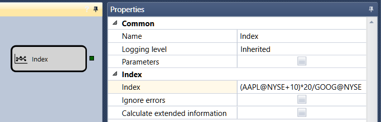

# Index

The cube is used to create your own index. 

### Outgoing sockets

Outgoing sockets

- **Security** \- the calculated index, represented as an **Security**.

### Parameters

Parameters

- **Index** \- the mathematical formula of a combination of several instruments (for example, (AAPL@NASDAQ+10)\*(abs(20\/GOOG@NYSE)).
- **Ignore errors** \- the set flag indicates that errors will be ignored when calculating the index.
- **Calculate extended information** \- the set flag indicates that in calculating the index, in addition to the basic information (Total volume, Opening price, Closing price, Highest price, Lowest price), the extended information (Total trade turnover, Opening volume, Closing volume, Maximum volume , Minimum volume) will be calculated.

Together with the standard mathematical operators, you can use the following functions:

- **abs(a)** \- returns the absolute value of a number.
- **acos(a)** \- returns the angle which cosine is equal to the specified number.
- **asin(a)** \- returns the angle which sine is equal to the specified number.
- **atan(a)** \- returns the angle which tangent is equal to the specified number.
- **ceiling(a)** \- returns the smallest integer that is greater than or equal to a specified number.
- **cos(a)** \- returns the cosine of the specified angle.
- **exp(a)** \- returns the value of **e** raised to the specified power.
- **floor(a)** \- returns the largest integer that is less than or equal to the specified number.
- **log(a)** \- returns the natural logarithm (with base **e**) of the specified number.
- **log10(a)** \- returns the logarithm with base 10 of the specified number.
- **max(a, b)** \- returns the larger of two decimal numbers.
- **min(a, b)** \- returns the smaller of two decimal numbers.
- **pow(a, b)** \- returns the specified number raised to the specified power.
- **sign(a)** \- returns an integer indicating the sign of the specified number.
- **sin(a)** \- returns the sine of the specified angle.
- **sqrt(a)** \- returns the square root of the specified number.
- **tan(a)** \- returns the tangent of the specified angle.
- **truncat(a)** \- calculates the integer part of the specified number.

## Recommended content

[Variable](Designer_Variable.md)
