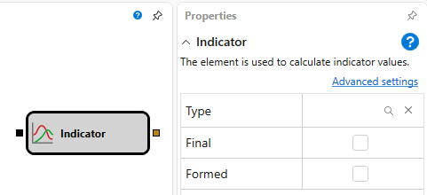

# Indicator

The cube is used to calculate the indicator values.

#### Incoming sockets

Incoming sockets

- **Any data** – the specific data type on the basis of which the selected indicator should be calculated (depending on the indicator this can be a numerical value, a candle, etc.).

#### Outgoing sockets

Outgoing sockets

- **Indicator** – the calculated indicator value that can be used to display on the chart panel or for further calculations.

#### Parameters

Parameters

- **Indicator type** \- the parameter used to select the required indicator, and several additional parameters that correspond to the selected indicator type. The set of these parameters changes when the selected indicator type is changed.

## Recommended content

[Logical condition](Designer_Logical_condition.md)
