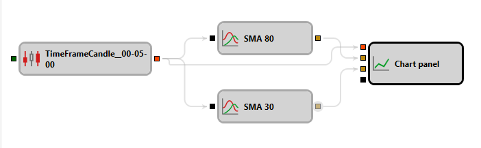

# Indicator

This block is used for calculating indicator values.

#### Incoming Sockets

Incoming Sockets

- **Any Data** – a specific type of data based on which the selected indicator should be calculated (depending on the indicator, this could be a numerical value, candle, etc.).

### Outgoing Sockets

Outgoing Sockets

- **Indicator** – the calculated indicator value, which can be used for display on the chart panel or further calculations.

### Parameters

Parameters

- **Indicator Type** - a parameter used to select the desired indicator, and several additional parameters that correspond to the selected indicator type. The set of these parameters changes when the selected indicator type changes.
- **Final** - pass only [final values](Indicators.md) of the indicator.
- **Formed** - pass only values when the indicator is fully [formed](Indicators.md).

## See Also

[List of Indicators](IndicatorsAll.md)
[Logical Condition](Designer_Logical_condition.md)
