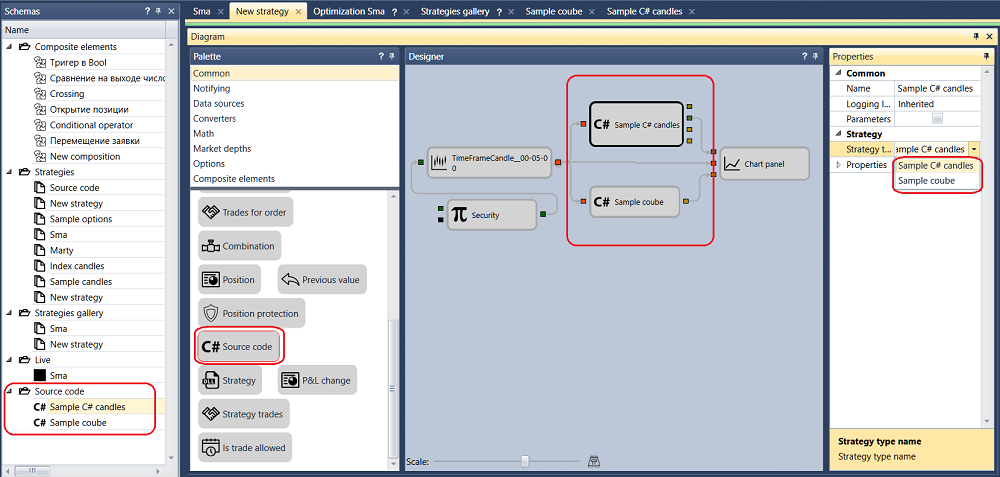

# Put C\# code into schema

To add the SMA strategy described in [Using C\#](Designer_Creating_strategy_from_code.md) section, you should select the [Source code](Designer_Source_code.md) cube in the **Palette** and move it to the **Designer** panel. In the **Source code** cube properties, you should select the strategy name:

Since the ProcessCandle(Candle candle) method ([First C\# strategy](Designer_Creating_strategy_from_source_code.md) section) accepts the candles, you need to add the candle cube and the [Variable](Designer_Variable.md) cube with the **Instrument** type. Join all the cubes with lines. Since [Designer](Designer.md) does not limit the number of any cubes in the strategy, you can use several [Source code](Designer_Source_code.md) cubes in one strategy. The most rational approach is to combine cubes. Those actions that are easier to write in the code are worth writing in the code and integrating with the help of the [Source code](Designer_Source_code.md) or [DLL import](Designer_DLL_Strategy.md) cubes. And those actions, which are easier to do with standard cubes, should be done with standard cubes. An example with this approach is described in the [Combine C\# code and visual designer](Designer_Combine_Source_code_and_standard_elements.md) section.

## Recommended content

[Combine C\# code and visual designer](Designer_Combine_Source_code_and_standard_elements.md)
