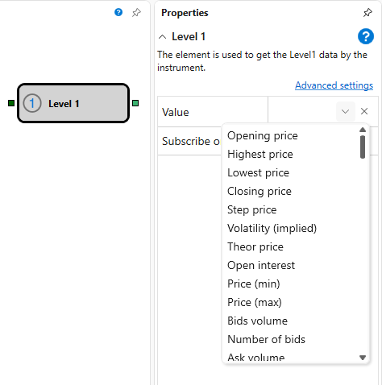

# Level 1

This block is used to receive **Level1** data for an instrument.

### Incoming Sockets

Incoming Sockets

- **Instrument** – the instrument for which **Level1** data needs to be received.

### Outgoing Sockets

Outgoing Sockets

- **Change** – **Level1** values of the tracked parameter.

### Parameters

Parameters

- **Value** – the **Level1** parameter that needs to be tracked.
- **Subscribe on Signal** – subscribe to data only after a trigger arrives.

## See Also

[Ticks](Designer_Ticks.md)