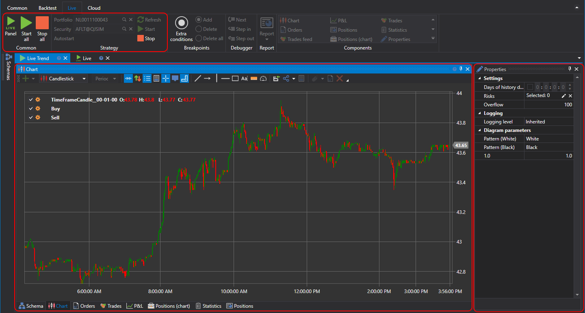

# User interface

After adding a strategy to the **Live** folder. Double\-click the added strategy to open the Live Strategy name tab. Switching to this tab will automatically open the **Live** tab in the **Ribbon**. On the **Live** tab, you can specify instrument and portfolio, with which the strategy will work. Clicking the **Start** button starts the strategy Live trade, clicking the **Stop** button \- stops it. 

The strategy tab contains Designer for strategy schemas and composite elements, similar to the one, described in the [Diagram panel](Designer_Designer_schemes_strategies_and_component_elements.md) section. But in the case of Live trade you cannot move, add or remove cubes and connections. Also, the tab contains the [Live settings](Designer_Properties_Live.md) panel, by default this panel is minimized and attached to the right side of the tab.

## Recommended content

[Connections settings](Designer_Connection_settings.md)
