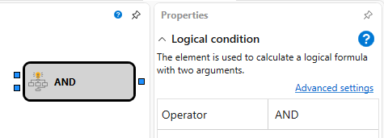

# Logical Condition

This element is used to compute a logical formula with two arguments.

### Incoming Sockets

Incoming Sockets

- **Flag** – the flag value (characterizes the state and has two values: raised (true) and lowered (false)).
- **Flag** – the flag value (characterizes the state and has two values: raised (true) and lowered (false)).

### Outgoing Sockets

Outgoing Sockets

- **Flag** – the flag value (characterizes the state and has two values: raised (true) and lowered (false)).

### Parameters

Parameters

- **Operator** - a predefined set of logical formulas AND, OR, Exclusive OR.

## See Also

[Formula](Designer_Universal_formula.md)