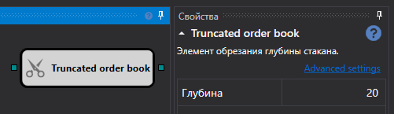

# Truncated order book

The cube is used to obtain an order book truncated to a specified depth.

### Incoming sockets

Incoming sockets

- **Order book** is an order book that needs to be truncated.

### Outgoing sockets

Outgoing sockets

- **Order book** is the truncated order book.

## Recommended content

[IV book](Designer_Depth_implied_volatility.md)
