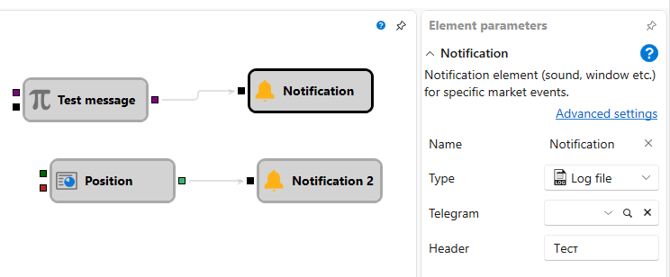

# Notification

The cube is used to notify the user when certain signals occur. 

### Incoming sockets

Incoming sockets

- **Flag** \- the signal (flag) that initiates the notification process.

### Parameters

Parameters

- **Type** \- type of message (pop\-up window, e\-mail, sms, etc.). The types of notifications are described in the [Notification settings](Designer_notification_Setting.md) section.
- **Header** \- the header of the message.
- **Message** \- the text of the message.

## Recommended content

[Notification settings](Designer_notification_Setting.md)
