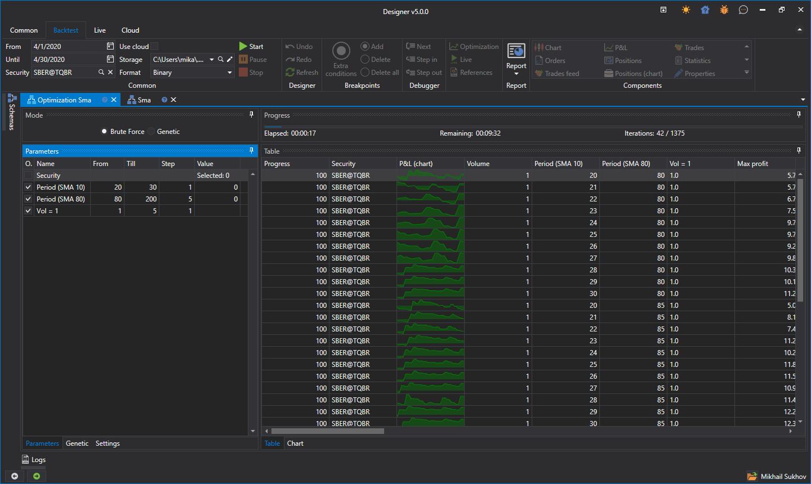

# Brute-force

To switch to strategy optimization mode, click the **Optimization** button on the **Emulation** tab. The optimization example will be considered using the SMA strategy created [from cubes](Designer_Algorithm_creation_of_elements.md).

A tab named Optimization + “Strategy Name” will open in the workspace. The **Optimization** tab is divided into two areas, **Properties**, **Optimization Result**: 

- The **Properties** area consists of tabs with several tables. The first is the strategy parameters, which are [iterated over](Designer_Optimization_Params.md). The second - settings for [genetics](Designer_Genetic.md). The third - system settings of the optimizer. For example, you can change the number of threads and cores involved in the optimization there.
- The **Optimization Result** area is a table, each row of which is the result of testing the strategy with unique parameters. Also, in the **Optimization Result** area, there is a progress bar showing the optimization progress, elapsed time, and estimated time until the end of optimization. Additionally, there is a tab for displaying the results in the form of a [3D chart](Designer_Optimization_3D_Chart.md).

Setting the parameters for iteration results in more than 1000 iterations. After starting the optimizer, the progress at the top above the results will show data on the planned number of iterations, how many have already been completed, and how much time is approximately needed until completion:

## See also

[Example of backtesting](Designer_Example_of_backtesting.md)