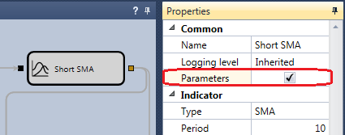

# Optimization Parameters

Optimization is performed on strategy parameters that have the following types:

- Numerical (integer and fractional)
- Time ([TimeSpan](xref:System.TimeSpan))
- Boolean value (True-False)
- [Unit](Unit.md) value

By default, all parameters with these types will be represented in the [optimizer parameters table](Designer_Optimization.md). If it is necessary to exclude some parameter from the optimization, then:

- In the case of a [diagram](Designer_Creating_strategy_out_of_blocks.md), it is necessary to select the required cube, open its property, switch to **Advanced settings** and turn off the **Parameter** checkbox:



- In the case of [code](Designer_Creating_strategy_from_code.md), you need to write code when defining a parameter and change the [CanOptimize](xref:StockSharp.Algo.Strategies.IStrategyParam.CanOptimize) property:

```cs
_long = this.Param(nameof(Long), 80);
_short = this.Param(nameof(Short), 20);
			
// turn off param for optimization
_long.CanOptimize = false;
```

After changing the available optimization parameters, it is necessary to reopen the [optimization panel](Designer_Optimization.md).