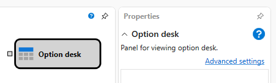
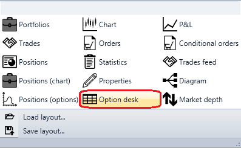
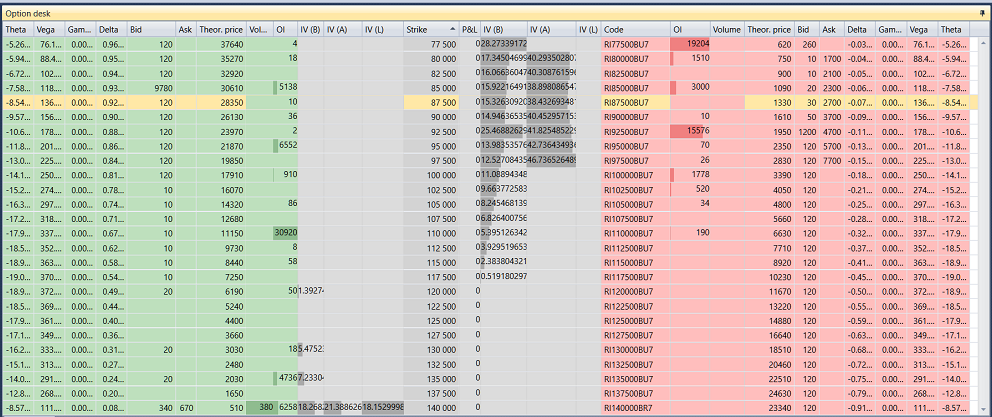

# Option desk

The cube is used to display the option desk.

To display the **Option desk**, you need to add the **Option desk** graphic component.

### Incoming sockets

Incoming sockets

- **Model** – the calculation model (for example, Black-Scholes).

## Recommended content

[Chart positions](Designer_Graph_options_positions.md)
