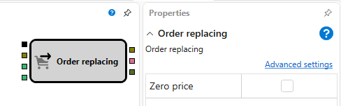

# Order Movement

This block is used for modifying an order for an instrument.

### Incoming Sockets

Incoming Sockets

- **Trigger** - the signal that determines when to move an order.
- **Order** – the order that will be modified.
- **Price** – numerical value of the new price.
- **Volume** – numerical value of the new volume.

### Outgoing Sockets

Outgoing Sockets

- **Order** – the modified order, which can be used to obtain transactions for it using the **Transactions by Order** element and for display on the chart using the **Chart Panel** block.
- **Error** – an error in moving the order.
- **Trade** – the trade for the placed order.

Parameters

- **Zero Price** – a zero price registers a market order.

## See Also

[Transactions by Order](Designer_Deals_on_request.md)