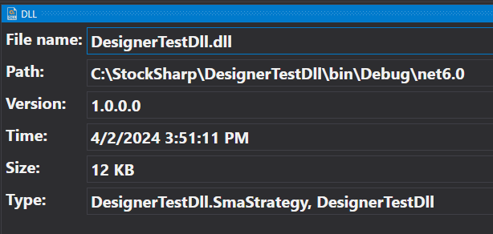

# DLL Panel

The DLL panel displays the meta-information of a .NET assembly:

In the panel, you can see the file creation time, its version, and path. The creation time is the easiest way to determine which assembly version is being used by **Designer**.

When recompiling the assembly through an [external program](Designer_Creating_DLL_element_in_Visual_Studio.md), the metadata will be automatically updated.