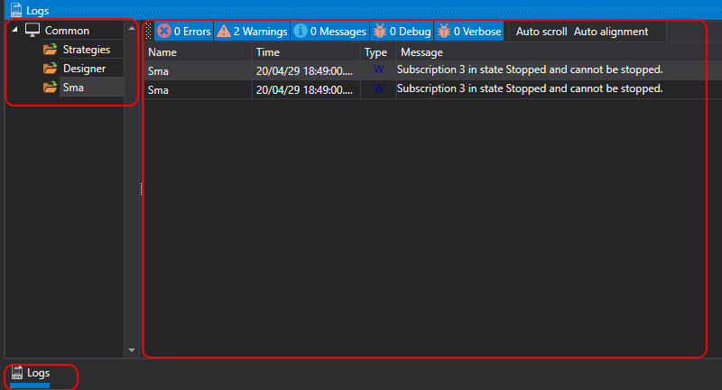

# Logs Panel

To simplify monitoring the operation of the program, there is a special **Logs** panel. This panel displays messages from all sources, strategies, and connections. In the **Logs** panel, the nesting of sources is shown as a tree. Each parent node contains messages of all nested sources and so on, down to the lowest level. For strategies, this hierarchy allows you to see child strategies. To open the **Logs** panel, you need to press the **Logs** button in the **Common** tab.

## See Also

[Portfolios](Designer_Panel_Portfolios.md)