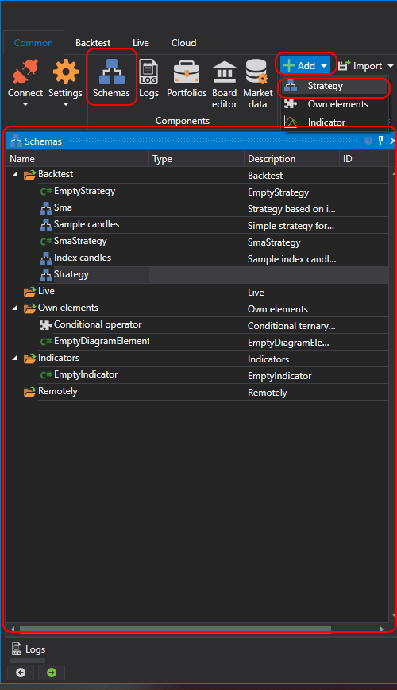

# Schemas

To open the **Schemas** panel, click the **Schemas** button in the **Common** tab. The **Schemas** panel contains a tree of scripts grouped into folders according to their purpose. Schemas of strategies and composite elements are no different. To edit them, one common editor, [Diagram panel](Designer_Designer_schemes_strategies_and_component_elements.md) is used. But, in order not to create confusion between them, they are divided into two independent lists and stored in different folders (strategies in the **Strategies** folder, composite elements in the **Composite elements** folder). The selection of the schema for editing is performed by double clicking the mouse on the required element in the list. The selected schema will open in the designer for viewing and editing. Below is a description of the **Schemas** panel folders:

1. The **Composite elements** folder contains elements that are a complete functionality and can be used in different schemas or one schema multiple times with different property values. Similar sets of elements can be put into a separate composite element, which will be used as any ordinary element. A **Composite element** is a conventional schema that is saved\/loaded\/edited as any strategy schema. To add a new composite element, click the **Add** button in the **Common** tab and select the **Composite element**. Or, right\-click the **Composite elements** folder in the **Schemas** panel, and click the **Add** button in the drop\-down menu. When you add new composite elements, they are automatically added to the **Element palette**, to the **Composite elements** group and can be used to create other strategy schemas and composite elements. **Composite elements** are described in detail in the [Composite elements](Designer_Creating_composite_elements.md) section.

2. The **Strategies** folder contains strategies that represent a schema from a set of elements and the links between them, called connections. To add a new strategy, click the **Add** button in the **Common** tab and select **Strategy**. Or, right\-click the **Strategy** folder in the **Schemas** panel, and click the **Add** button in the drop\-down menu. **Strategies** are described in detail in the [Using visual designer](Designer_Creating_strategy_out_of_blocks.md) section.

3. The **Strategy gallery** folder contains the strategies you subscribed to in the Strategy gallery panel. **Strategy gallery** is described in detail the [Strategy gallery](Designer_Gallery_of_strategies.md) section.

4. The **Live** folder contains strategies that are added to run in the trade. With that, the strategies that are running are marked with the  icon, and which are stopped are marked with the  icon. How to add strategies to the **Live** folder and how to start them is described in the [Live execution](Designer_Live_trade.md) section.

5. The **Source code** folder contains the strategies that are created using the library for the professional development of trading algorithms in C\# [API](StockSharpAbout.md). To add a new strategy to the **Source code** folder, click the **Add** button in the **Common** tab and select **Source code**. Or, right\-click the Source code folder in the **Schemas** panel and click the  button in the drop\-down menu.

## Recommended content

[Logs](Designer_Panel_Logs.md)
