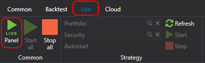
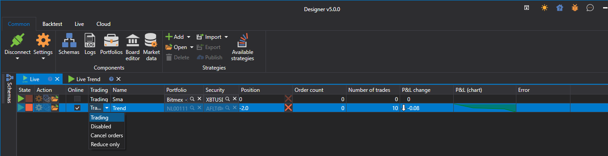

# Strategies dashboard

Clicking the  button on the **Live** tab opens the **Live** panel.

The **Live** panel is a table, displaying all strategies, added to the **Live**. On the **Live** panel, you can view the strategy current state, and run or stop the strategy using the ,  buttons.

- The first column is responsible for starting/stopping the strategy.
- The second column is for strategy settings.
- **Online** indicates whether all strategy indicators are formed and all subscriptions have transitioned to an **Online** [state](API_ConnectorsSubscriptions.md).
- **Trading** allows you to change available operations. For example, prohibit opening new positions or increasing existing ones.
- **Position** shows the current position for the strategy's instrument. Clicking the cross button will close the position.
- The other columns display the current trading statistics of the strategy.

Double-clicking on a selected row will open the panel with the strategy.

## Recommended content

[Live execution sample](Designer_Example_of_Live_trading.md)
