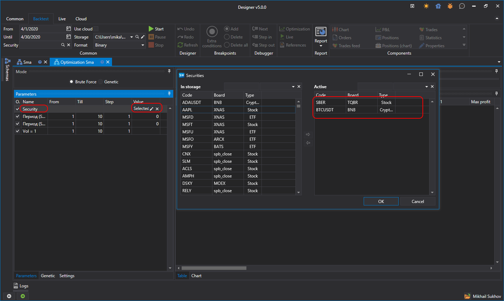

# Portfolio optimization

The [S\#.Designer](Designer.md) features ability to test one strategy on various securities at the same time. To do that, click the [Optimization](Designer_Optimization.md) button.

In optimization parameters set the **Security** parameter, select from the list the securities for which you want to perform testing. Set the testing period and he market\-data storage in the **Ribbon**. After clicking the **Start** button, the testing will start on all securities simultaneously.

## Recommended content
