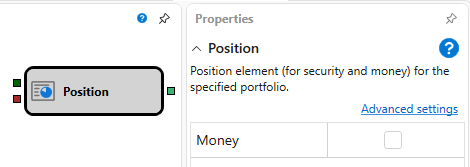

# Position

The element is used to obtain information on the position change for the specified instrument and portfolio.

#### Incoming sockets

Incoming sockets

- **Instrument** \- the instrument for which you want to obtain a position.
- **Portfolio** \- the portfolio for which you want to obtain a position.

#### Outgoing sockets

Outgoing sockets

- **Position** \- the numeric value of the position on the instrument or the current amount of available funds on the account, it is generated when they are changed and after the strategy is started.

#### Parameters

Parameters

- **Money** \- when the flag on the input is set, the element only accepts the portfolio, the money position for the selected portfolio is passed to the output of the element.

## Recommended content

[Prev value](Designer_Previous_value.md)
