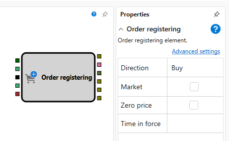
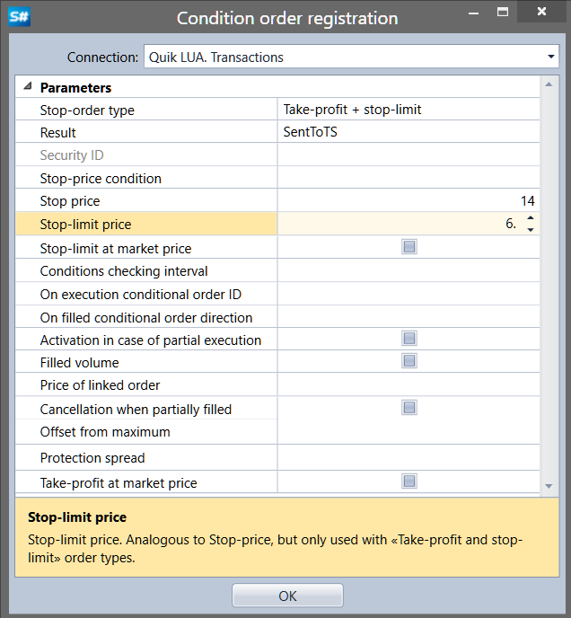

# Register order

The cube is used to open a position on the instrument.

### Incoming sockets

Incoming sockets

- **Instrument** – the instrument for which you need to register an order.
- **Direction** – the direction of the order (purchase or sale), it is the signal of the order registering.
- **Price** – the numerical value of the price, if the not market order is registered.
- **Volume** – the numerical value of the volume.
- **Portfolio** – the portfolio for which you need to register an order.

### Outgoing sockets

Outgoing sockets

- **Order** – the order that can be used to obtain trades on it by using the **Trades** element on the order and displaying it on the chart using the **Chart panel** cube.

### Parameters

Parameters

- **Market** – the attribute of a market order.
- **Client code** – the client code assigned by the broker, if the value is not specified and the **Parameters** option is checked, then the value is taken from the strategy.
- **Broker** – the code of the brokerage firm, if the value is not specified and the **Parameters** option is checked, then the value is taken from the strategy.
- **Conditional order** – to add a conditional order.

## Conditional order settings

Conditional order is the order with additional conditions that determine the time of registration in the trading system depending on the current market situation.

- **Connection** \- the connection where the order will be registered.
- **Stop\-order type** \- the stop\-order type.
- **Result** \- the result of the stop order execution.
- **Security ID** \- the instrument ID for s stop\-orders with a condition for another instrument.
- **Stop price condition** \- the stop\-price condition. Used for orders such as "Stop\-price for another security".
- **Stop\-price** \- the stop\-price that sets the condition for the stop\-order to trigger.
- **Stop\-limit price** \- the stop\-limit price. It is similar to the stop\-price, but it is used only for the order type "Take\-profit and Stop\-limit".
- **Stop\-limit at market price** \- the attribute of execution of the "Stop\-limit" order at the market price.
- **Conditions checking interval** \- time for order conditions checking only for a specified time period (if the value is null, then do not check). It is used for orders of the types "Take\-profit and stop\-limit" and "Take\-profit and stop\-limit on order".
- **On execution conditional order ID** \- the ID of the conditional order on execution.
- **On filled conditional order direction** \- the direction of the conditional order on execution.
- **Activation in case of partial execution** \- a partial execution of the order is taken into account. The "on execution" order will be activated when the order\-condition is partially executed.
- **Filled volume** \- to take the executed volume of the order as the amount of the registered stop\-order. As the number of securities in the "on execution" order the executed volume of the order\-condition is accepted.
- **Price of linked order** \- the price of the linked limited order.
- **Cancellation when partially filled** \- the attribute of the stop\-order cancellation in case of partial execution of the linked limited order.
- **Offset from maximum** \- the amount of an offset from the maximum (minimum) of the last trade price.
- **Protection spread** \- the amount of the protection spread.
- **Take\-profit at market price** \- the attribute of execution of the "Take\-profit" order at the market price.

## Recommended content

[Modify order](Designer_Orders_Moving.md)
