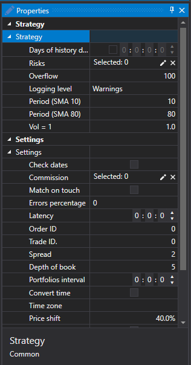

# Backtesting settings

The **Properties** panel is minimized on the right side of the strategy tab by default. This panel is a table of emulation or Live trade properties. When you select a specific property, a detailed description of this property appears at the bottom of the table. All properties are grouped into groups:

**Settings**

- **Market data** – the data storage.
- **Storage format** – the storage format.
- **Data type** – the data type.
- **Time frame** – to use candles with the specified time\-frame.
- **Maximum quote volume in generated depth** – the maximum quote volume in generated order book.
- **Interval** – the time interval.
- **Unrealized P\/L** – the interval of recalculation of the unrealized profit.
- **Trades** – which trades to use.
- **Marked depth** – which order books to use.
- **Order log** – to use the order log.
- **Number of strategies** – the number of simultaneously tested strategies.
- **Logging level** – the logging level.
- **Combine on touch** – when emulating the combine on trades, perform the combine of orders when the trade price touched the order price (equal to the order price).
- **Marked depth (lifetime)** – the maximum time during which the order book is in the emulator. If during this time there was no update, the order book is deleted. This property can be used to remove old order books when there are holes in the data.
- **Errors percentage** – the percentage value of the error in registering new orders. The value can be from 0 (there will be no errors) to 100.
- **Latency** – the minimum value of the registered order latency.
- **Reregistering** – whether order reregistering is supported as a single trade.
- **Buffering period** – to send responses in whole packet with intervals. The network latency and the buffered work of the exchange core are emulated.
- **Order ID** – the number from which the emulator will generate identifiers for orders.
- **Trade ID** – the number from which the emulator will generate identifiers for trades.
- **Transaction** – the number from which the emulator will generate identifiers for order transactions.
- **Spread size** – the spread size in the price steps. It is used in specifying the spread for the generation of an order book from tick trades.
- **Depth of book** – the maximum depth of the order book that will be generated from the ticks.
- **Number of volume steps** – the number of volume steps for which the order is larger than the tick trade. It is used for testing on tick trades.
- **Portfolios interval** – the interval for the recalculation of portfolios data. If the interval is zero, no recalculation is performed.
- **Change time** – to change time for orders and trades into exchange time.
- **Time zone** – information about the time zone where the exchange is located.
- **Price shift** – the price shift from the last trade, specifying the limits of the maximum and minimum prices for the next session.
- **Add extra volume** – add extra volume to the order book when orders with large volume are being registered.
- **[Commissions](Designer_Commission_Rule.md)** – the commission (brokerage, exchange, etc.).

**Logging**

- **Logging level** – the logging level for this element.

**Setting**

- **[Risk management](Designer_Risk_Rule.md)** – the risk management settings.

**Diagram parameters**

- **Security** \- the security.
- **Portfolio** \- the portfolio.

If you do not fill in the **Diagram parameters**, when emulating, the instrument will be used from the **Instrument** field of the **Emulation** tab, and as a portfolio, the test portfolio will be used by default.

## Recommended content

[Chart](Designer_Chart.md)
