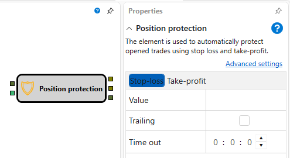

# Protect position

The cube is used to automatically protect opened trades using stop loss and take\-profit.

### Incoming sockets

Incoming sockets

- **Trade** \- the trade that must be protected with a stop\-loss and take\-profit.

### Outgoing sockets

Outgoing sockets

- **Order** – orders that were registered by one of the protection strategies.

### Parameters

Parameters

- **Take\-profit** \- the take\-profit value.
- **Stop\-loss** \- the stop\-loss value.

## Recommended content

[Source code](Designer_Source_code.md)
