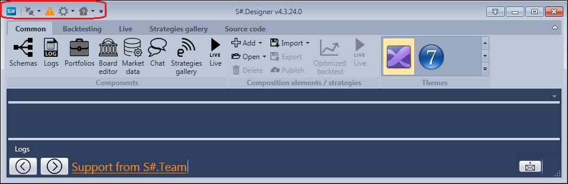

# Quick access panel

The **Quick access panel** is located at the top of the [S\#.Designer](Designer.md) window and is intended for quick access to the most frequently used functions.

1. When you click the  button [S\#.Designer](Designer.md) connects to trading terminals and data sources (see the [Connections settings](Designer_Connection_settings.md) and [Market data storage](Designer_Repository_of_historical_data.md) sections for details about working with data sources).
2. Clicking the  button opens [Logs](Designer_Panel_Logs.md). 
3. When you click the  button, you will be able to change the program settings ([Launch settings](Designer_Start_mode.md)), interface language, or completely [Reset settings](Designer_Reset_language_settings.md) of [S\#.Designer](Designer.md).

## Recommended content

[Ribbon](Designer_Tape.md)
