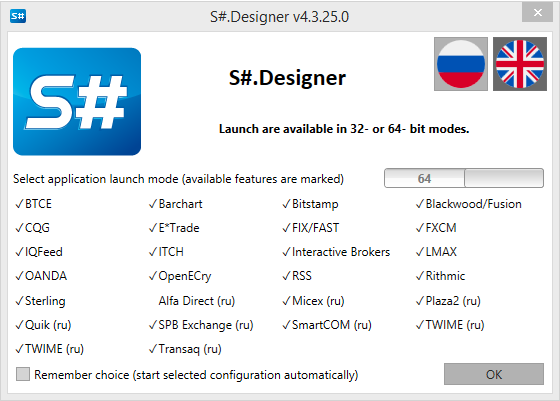
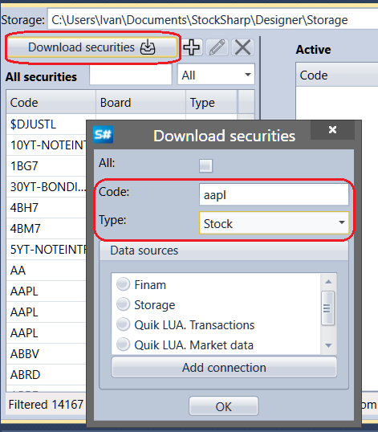
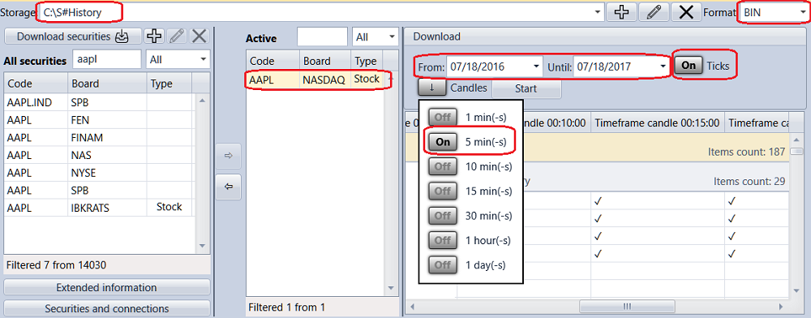
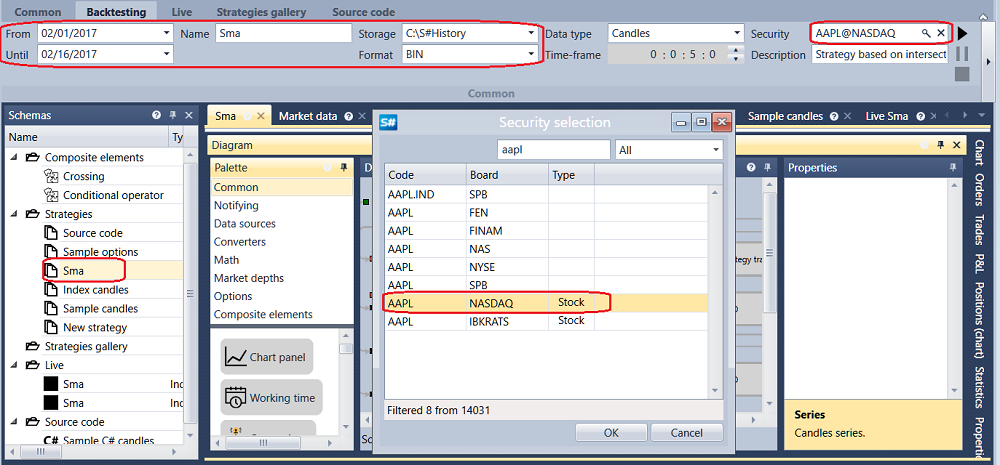
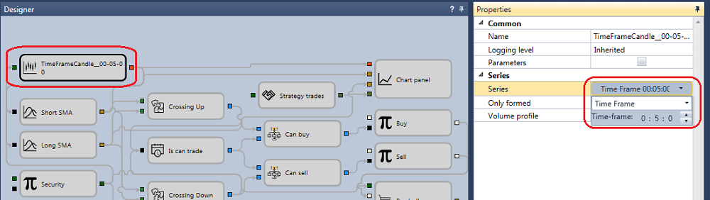
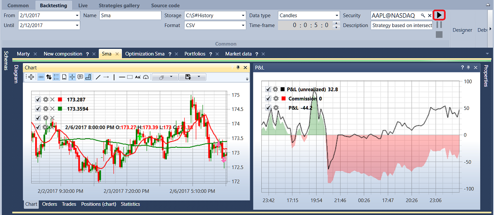

# Quick start

When you start [S\#.Designer](Designer.md) for the first time, the following window will be displayed:

You should select the startup mode and click **OK**.

On first run [S\#.Designer](Designer.md) will prompt you to open the [Download market\-data](Designer_Downloading_data.md) window. Also, historical data can be downloaded by the [S\#.Data](Hydra.md) program (codenamed Hydra) designed for automatically downloading market data (instruments, candles, tick trades and order books, etc.) from various sources and storing them in a local storage. About downloading and storing historical data is described in detail in the [Market data storage](Designer_Repository_of_historical_data.md) section.

When you click the **Download securities** button, the [Download instruments](Designer_Download_instruments.md) window appears. To download the instrument, you should enter the instrument code, instrument type, select the data source and click **OK**. [S\#.Designer](Designer.md) will query the data source for available instruments. All found instruments will appear in the **All securities** panel. By default, it is specified as a data source in [S\#.Designer](Designer.md). You can also use trading terminals as a data source. How to configure the connection to terminals is described in the [Connections settings](Designer_Connection_settings.md) section.

To obtain historical data on the instrument, you should select the necessary instrument from the **All securities** list, set the historical data period, select the type and Time Frame of the candles and press the **Start** button. All data will be stored in the [Market data storage](Designer_Repository_of_historical_data.md).

After obtaining the historical data, choose one of the demonstration strategies. Double\-click the [Schemas](Designer_Panel_Schemas.md) panel in the **Strategy** folder selects the **SMA** strategy example, after that the Sma tab appears in the workspace. After switching to the strategy, in the bar the **Emulation** tab will automatically open, which contains the main elements for strategy creation, debugging, strategy testing ([Strategies](Designer_Creation_strategy.md), [Getting started](Designer_Example_of_backtesting.md))

In the **Emulation** tab, you need to set a test period, and select [Market data storage](Designer_Repository_of_historical_data.md) in the **Market Data** field.

Clicking the  icon in the **Security** field opens the **Select security** window. You should select the required instrument in this window.

After selecting any block in the **Designer** panel, the properties of this block appear in the **Properties** panel. In the **Properties** panel of the **Candles** block, you can set the type and Time Frame of [Candles](Candles.md).

After clicking the **Start** button, the trading emulation will start.

