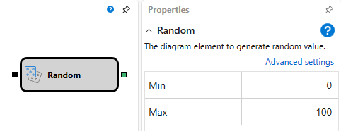
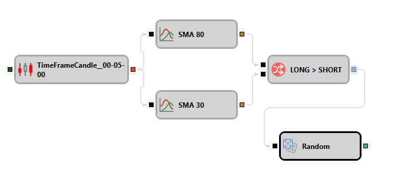

# Random Value

This block is used to generate a random value.

#### Incoming Sockets

Incoming Sockets

- **Trigger** – the signal that determines the moment when it is necessary to pass a generated random value through the outgoing socket.

### Outgoing Sockets

Outgoing Sockets

- **Value** – a random value.

### Parameters

Parameters

- **Min** - the minimum permissible value boundary.
- **Max** - the maximum permissible value boundary.

## See Also

[Change in P/L](Designer_StrategyPnLDiagramElement.md)