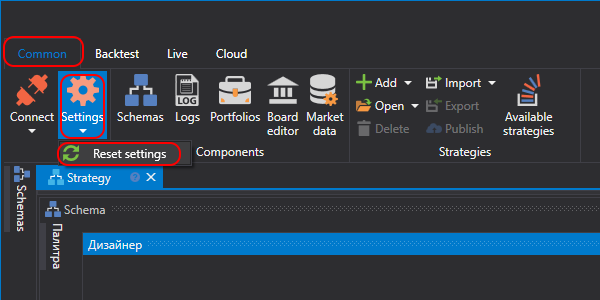
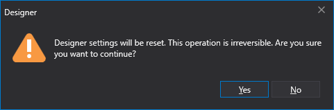

# Reset settings

> [!CAUTION]
> **CAUTION\!\!\! Prior to resetting please read this paragraph through\!**

On the **Quick access panel**, located by default at the top of the [Designer](Designer.md), window, there is a **Settings**  button. Clicking the  button allows changing the program launch mode, interface language or totally reset the [Designer](Designer.md) settings.

When the **Resetting** is selected, the confirmation window is opened.

After clicking the **OK** button all [Designer](Designer.md) settings will be reset to default values. The directory with the [Designer](Designer.md) will be cleared completely, **all created strategies and downloaded instruments and other information stored in the settings directory will be DESTROYED.**

## Recommended content

[Settings directory](Designer_Directory_and_edit_data_manually.md)
