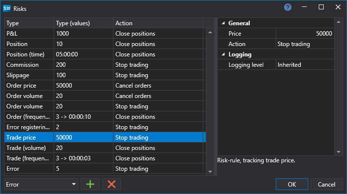

# Risk management

In the [Backtesting settings](Designer_Properties_emulation.md) and [Live settings](Designer_Properties_Live.md) panels, you can set the risk control settings.

In the Risk window, you should select the **Risk\-rule**, configure the trigger condition for the **Risk\-rule** and the action (Close positions, Stop trading, Cancel orders), which will be executed when the **Risk\-rule** condition is triggered.

#### List of Risk\-rules

List of Risk\-rules

- **Order (volume)** – the risk\-rule that monitors the volume of the order.
- **Order (price)** – the risk\-rule that monitors the order price.
- **Order (frequency)** – the risk\-rule that monitors the frequency of orders.
- **Commission** – the risk\-rule that monitors the amount of the commission.
- **P\/L** – the risk\-rule that monitors profit\-loss.
- **Position** – the risk\-rule that monitors the position size.
- **Position (time** – the risk\-rule that monitors the lifetime of a position.
- **Slippage** – the risk\-rule that monitors the slippage size.
- **Trade (volume)** – the risk\-rule that monitors the trade volume.
- **Trade (price)** – the risk\-rule that monitors the trade price.
- **Trade (frequency)** – the risk\-rule that monitors the frequency of trades.

## Recommended content
