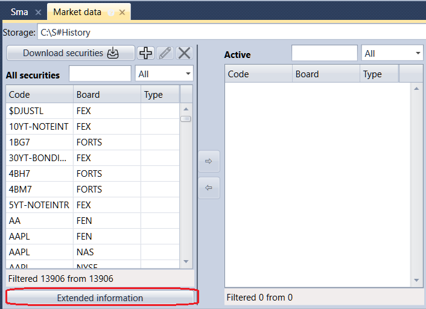

# Instrument extended info

Any necessary information on security (for example, country, city, website etc.) may be extended info.

For more information about the extended information, see the [Extended instrument info](HydraExtensionInfo.md) documentation on [S\#.Data](Hydra.md).
