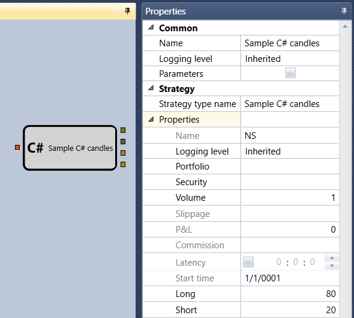

# Source code

The cube is used to add cubes created from the source code ([Using C\#](Designer_Creating_strategy_from_code.md)). 

### Parameters

Parameters

- **Name of strategy type** \- the name of the strategy type that you want to add.

## Recommended content

[DLL import](Designer_DLL_Strategy.md)
