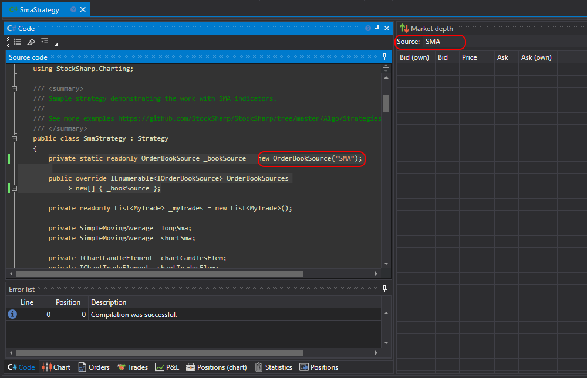
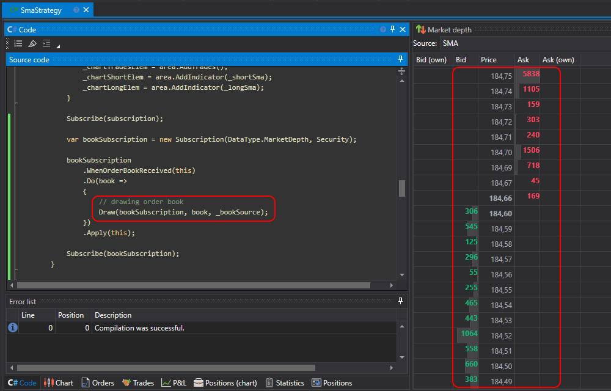

# Drawing Order Book

A strategy from code can draw data on the [Order Book](Designer_Depth_Panel2.md) panel similarly to the [Order Book](Designer_Depth_panel.md) cube. For this, the following code needs to be written.

1. Create a descendant of the [IOrderBookSource](xref:StockSharp.Algo.Strategies.IOrderBookSource) interface, which **Designer** uses to identify the source. In the example case, the [OrderBookSource](xref:StockSharp.Algo.Strategies.OrderBookSource) class is used, which is the default implementation of the interface:

```cs
private static readonly OrderBookSource _bookSource = new OrderBookSource("SMA");
```

2. Override the [OrderBookSources](xref:StockSharp.Algo.Strategies.Strategy.OrderBookSources) property:

```cs
public override IEnumerable<IOrderBookSource> OrderBookSources
	=> new[] { _bookSource };
```

Thus, the strategy will indicate to external code (in this case, the [Order Book](Designer_Depth_Panel2.md) panel) which sources of order books are available. The multitude of sources occurs in the case when the strategy works with several order books (different instruments, or order books with various modifications, such as, for example, [thinned order book](Designer_Depth_Spread.md)).

3. Add the initialization of the subscription to the order book in the strategy code. In the case of SmaStrategy, it is added to the end of the [OnStarted](xref:StockSharp.Algo.Strategies.Strategy.OnStarted) method:

```cs
var bookSubscription = new Subscription(DataType.MarketDepth, Security);
			
bookSubscription
	.WhenOrderBookReceived(this)
	.Do(book =>
	{
		// drawing order book
		Draw(bookSubscription, book, _bookSource);
	})
	.Apply(this);
			
Subscribe(bookSubscription);
```

In the Do handler, a call is made to the [Draw](xref:StockSharp.Algo.Strategies.Strategy.Draw) method, which sends the order book for drawing.

4. Add the [Order Book](Designer_Depth_Panel2.md) panel and select the source created in code:

  

5. After launching the strategy for testing, the order book will be filled with data:

  
