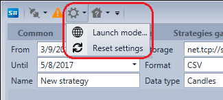
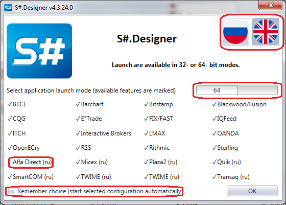

# Launch settings

On the **Quick access panel**, located by default at the top of the [Designer](Designer.md) window, there is a **Settings** button. Clicking the  button allows changing the program launch mode, interface language or totally reset the [Designer](Designer.md) settings.

When the **Launch mode** is selected, the window, allowing changing the interface language, is opened. The launch mode has options of 32\-bit and 64\-bit, at the launch mode selection the available functionality will be highlighted by the  icon, for example, in 64\-bit mode some connections (highlighted in the window) may not be available.

If the **Remember choice** is selected, the subsequent [Designer](Designer.md) launches will feature the preset settings.

## Recommended content

[Reset settings](Designer_Reset_language_settings.md)
