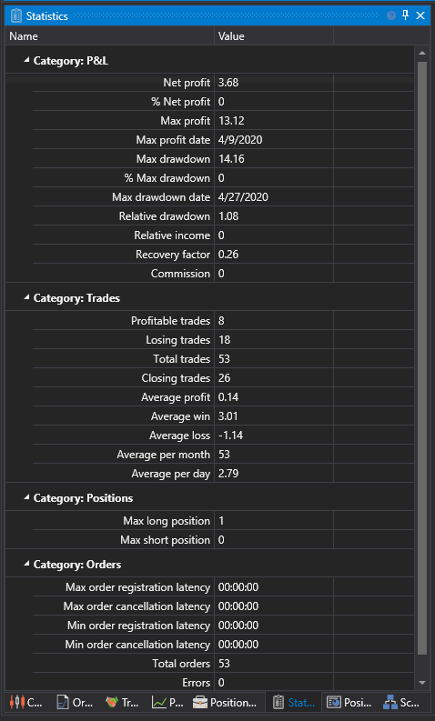

# Statistics

The **Statistics** component is a table grouped by categories: P/L, Trades, Positions, Orders. Statistics help to assess the correctness and performance of the strategy. For example, the sample strategy SMA cannot have more than 1 position. Statistics also help to evaluate the strategy's performance by other qualitative parameters, such as maximum drawdown, relative drawdown, recovery factor, etc.

## See Also

[Debugging](Designer_Debug.md)
