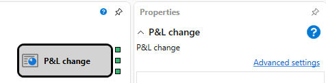

# P&L strategy

Documetation eng RemoteManager 

### Outgoing sockets

Outgoing sockets

- **P\/L unrealized** – is the numerical value of the unrealized profit\/loss.
- **P\/L realized ** – is the numerical value of the realized profit\/loss.
- **Commission fee** – is the numerical value of the commission fee.

## Recommended content

[Notification](Designer_Notice.md)
