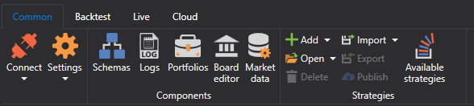

# Ribbon

The main element of the [S\#.Designer](Designer.md) user interface is a **Ribbon** that is located along the top of the application window. Using the ribbon, you can quickly find the necessary commands. The commands are arranged in logical groups, collected on tabs. To go to the required tab, just click its name. Each tab is associated with the type of action being performed.

1. The **Common** tab, which is opened by default after startup, contains the elements that you might need at the beginning of the work. In the **Common** tab, you can open [Schemas](Designer_Panel_Schemas.md), [Logs](Designer_Panel_Logs.md), [Portfolios](Designer_Panel_Portfolios.md), [Getting started](Designer_Creating_repository_of_historical_data.md), [Strategy gallery](Designer_Gallery_of_strategies.md), [Strategies dashboard](Designer_Panel_strategies.md), [Optimization](Designer_Optimization.md). Also in the **Common** tab, you can select the Theme of [S\#.Designer](Designer.md).

2. The **Backtesting** tab is automatically opened when you select a strategy in the [Schemas](Designer_Panel_Schemas.md) panel. The **Backtesting** tab contains the basic elements for creating a strategy, debugging, testing strategies. ([Strategies](Designer_Creation_strategy.md), [Getting started](Designer_Example_of_backtesting.md))

3. The **Live** tab is designed directly for real trading. Details of the connection settings are described in the [Connections settings](Designer_Connection_settings.md) section. Real trading using [S\#.Designer](Designer.md) is described in the [Live execution](Designer_Live_trade.md) section.

4. The **Strategies gallery** tab of [S\#.Designer](Designer.md) provides an opportunity not only to create strategies, but also to publish them. Also, it is possible to download ready\-made strategies published by other users. Details about the **Strategies gallery** are described in the [Strategy gallery](Designer_Gallery_of_strategies.md) section.

5. The **Source code** tab is automatically opened when selecting the contents of the **Source code** folder in the [Schemas](Designer_Panel_Schemas.md) panel. For details on creating strategies from the code, see the [Using C\#](Designer_Creating_strategy_from_code.md) section.

## Recommended content

[Workspace](Designer_Workspace.md)
