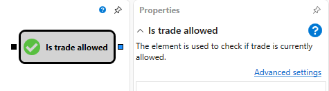

# Is Trading Allowed

This block is used to check if trading is currently allowed. The following conditions are checked:

- All strategy subscriptions to market data must be in [Online](API_ConnectorsSubscriptions.md) state (receiving real-time data).
- All indicators must be [formed](Indicators.md).
- In the case of [live trading](Designer_Add_strategy_Live_trade.md), the incoming trigger value must have a timestamp greater than the strategy's start time.

### Incoming Sockets

Incoming Sockets

- **Trigger** - the signal that determines the moment when the check should be performed.

### Outgoing Sockets

Outgoing Sockets

- **Flag** - a flag that determines whether the trading session is active.

## See Also

[Current Time](Designer_Time.md)