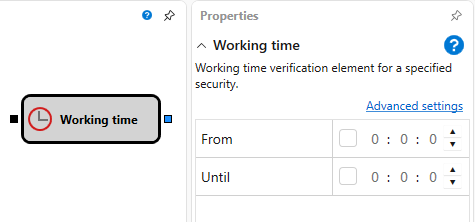
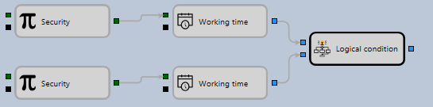

# Working time

The cube is used to determine the working time. For example, to determine when a particular instrument is trading.

### Incoming sockets

Incoming sockets

- **Instrument** \- an instrument for which you need to determine whether a trading session is active.
- **Trigger** \- is the signal used to determine when to check.

### Outgoing sockets

Outgoing sockets

- **Flag** \- a flag that determines whether a trading session is active.

The cube can be used to determine the moment when trades are conducted on several instruments from various trading platforms.

## Recommended content

[Comparison](Designer_Comparison.md)
