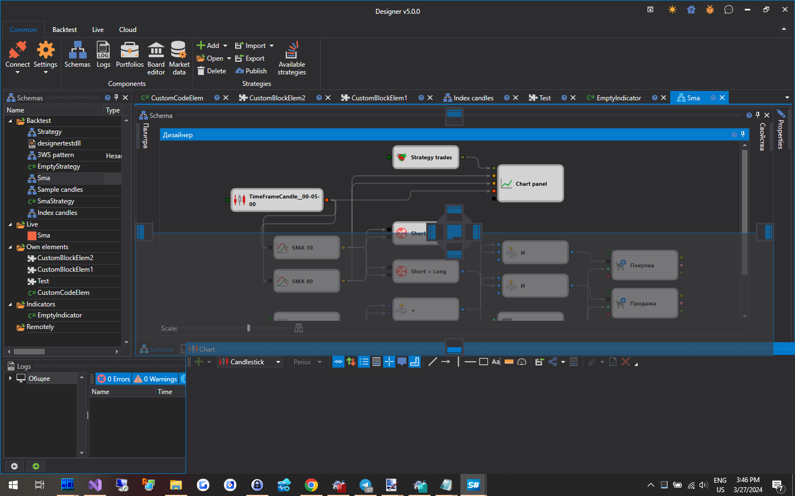

# Workspace

The **Workspace** in [Designer](Designer.md) is a windowed interface with locking of panels, like the one used in Microsoft Visual Studio. By clicking the header of the panel with the left mouse button, and holding it, you can lock the panel in a convenient place. And by dragging edges of the panel, you can adjust its height or width:

## Recommended content

[Schemas](Designer_Panel_Schemas.md)
