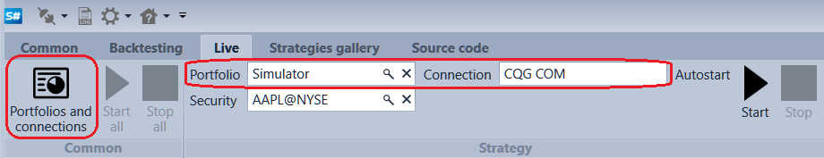
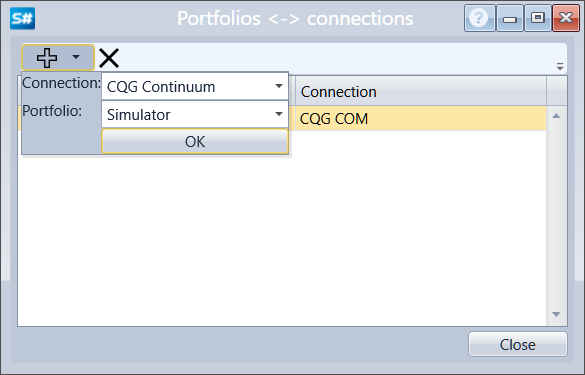

# Account and connection mapping

When connected, the **Designer**, if specified in the connector settings, automatically maps the received portfolios with the connections, from which these portfolios were received. Further, in the course of **Live**, selection of portfolio will automatically set up the connection, through which the trade will be performed.

You can view and change the mapped portfolios and connections by clicking the **Portfolios** and connections button on the **Live** tab.

In the appeared window, you can delete or add a mapping of portfolios and connections. For example, by clicking on the  button and selecting the **Transaq** connection and the Simulator portfolio, the Simulator portfolio will be mapped to the Transaq connection. Further, in the course of **Live trading**, choosing the Simulator portfolio for trading will use the Transaq connection.

