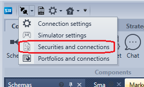
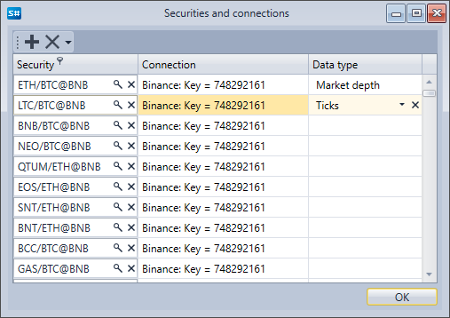

# Binding market data to connection

When connecting, if specified in the settings, the connector automatically matches the security data types with the connections from which these securities were received. You can view and change the matched security data types and connections by clicking the **Securities and Connections** button of the quick access toolbar. 

In the window that appears, you can delete or add a mapping of data types of securities and connections.

When you click on the  button, an empty field is added to the table in which you need to select the security, connection and data type. Thus, you can configure the getting different data types for the same security from different sources. For example, getting Level1 data from one source, and getting order book data from another.

