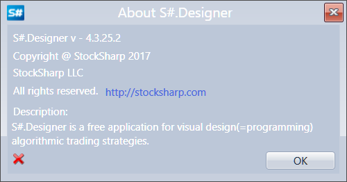
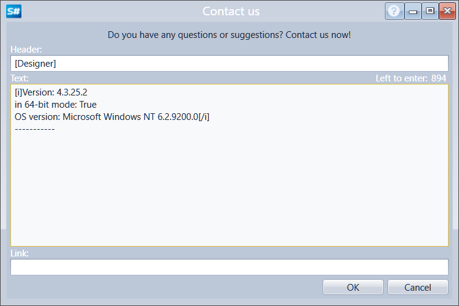

# Feedback forms

On the **Quick access panel**, located by default at the top of the [Designer](Designer.md) window, there is an **Help** button. Clicking the  button enables opening the Help window on work with **Designer**, information on the program, send your questions and suggestions.

Selection of Help opens the [Designer](Designer.md) help page in the browser.

Selection of **About** allows viewing information about the program, current version, availability of updates.

Selection of **Contact us** opens the feedback window for entering questions and suggestions.

