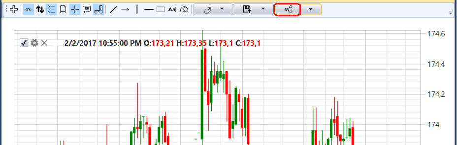
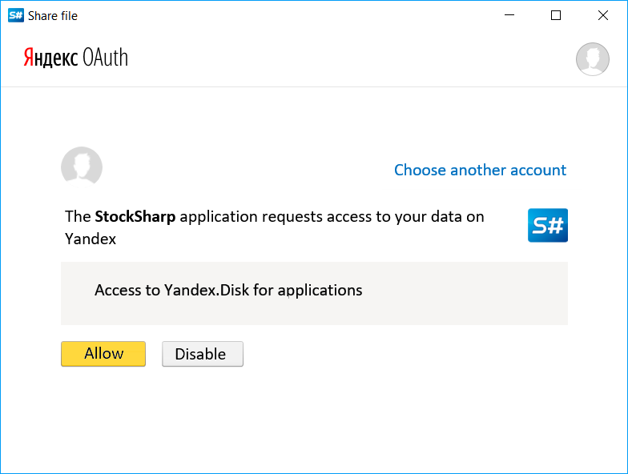
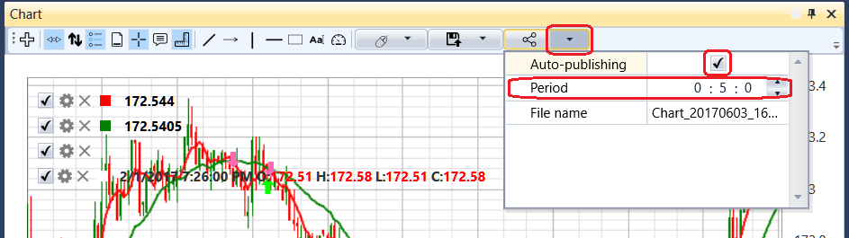

# Share images for charts and tables

[S\#.Designer](Designer.md) provides the ability to publish, as well as automatically publish charts and tables.

To publish, click the  button. 

For the first time, you will have to fill in the login and password and confirm access permission to the StockSharp application:

For automatic publishing open the , button and check the Auto\-publishing checkbox:

## Recommended content
