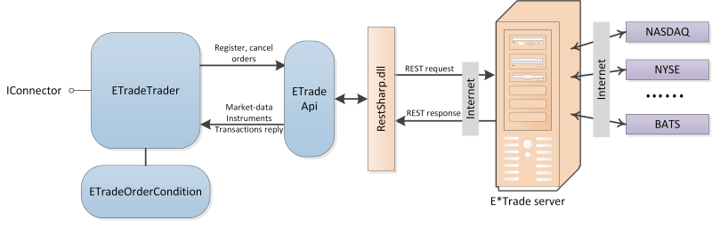
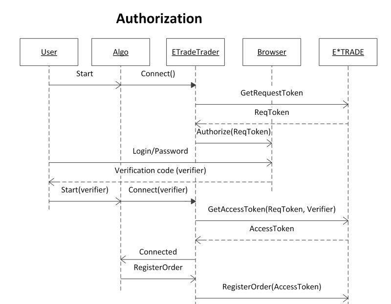

# Configuration E\*TRADE

To work with a connector, you have to specify the **Login** and **Password**. **Login** and **Password** are provided by the broker. To get the API access it is recommended to contact the broker.

The interaction mechanism is shown in this figure: 

[E\*TRADE](ETrade.md) uses the OAuth 1.0a authorization protocol, which requires a login and password over the browser on the [E\*TRADE](https://etrade.com/) site. The full authorization procedure sequence is shown in the following figure:

A full authorization procedure should be performed only one time a day (the [E\*TRADE](ETrade.md) server resets AccessTokens issued earlier at midnight by EST). If the full authorization procedure is already carried out on current day by EST, [ETradeTrader](../api/StockSharp.ETrade.ETradeTrader.html) automatically downloads AccessToken, stored in a subdirectory of [E\*TRADE](ETrade.md) algorithm.
