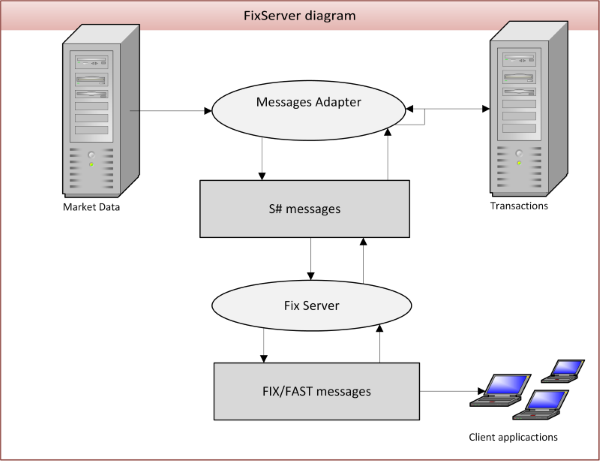

# FIX Server

[FixServer](xref:StockSharp.Server.Fix.FixServer) allows you to create own server, based on [FIX](https://en.wikipedia.org/wiki/Financial_Information_eXchange)\/[FAST](https://en.wikipedia.org/wiki/FAST_protocol) protocol communication. For a transactions uses the FIX 4.4, for market\-data \- FAST protocol. The scheme of interaction is shown in this figure: 

