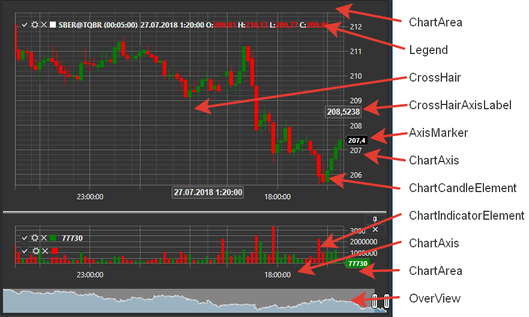

# Charts

[S\#](StockSharpAbout.md) provides convenient components for charts plotting. These components are assembled in the [StockSharp.Xaml.Charting](xref:StockSharp.Xaml.Charting) namespace. 

The key concept in the graphical library is a *chart*. *Chart* \- is a container for other elements, which are used in the chart plotting. There are several types of *charts* in [S\#](StockSharpAbout.md). 

- [Chart](xref:StockSharp.Xaml.Charting.Chart) \- the graphical component for displaying the exchange charts.
- [ChartPanel](xref:StockSharp.Xaml.Charting.ChartPanel) \- the advanced graphical component for displaying the exchange charts.
- [EquityCurveChart](xref:StockSharp.Xaml.Charting.EquityCurveChart) \- the graphical component for displaying the equity curve.
- [BoxChart](Gui_BoxChart.md) \- the chart showing the volumes in a grid of numbers.
- [ClusterChart](Gui_ClasterChart.md) \- the chart showing the volumes in the form of clusters with bar charts.
- [OptionPositionChart](xref:StockSharp.Xaml.Charting.OptionPositionChart) \- the graphical component showing the positions and the options Greeks with regard to the underlying instrument. See [OptionPositionChart](OptionPositionChart.md).

Besides that, [S\#](StockSharpAbout.md) includes two types of charts for the volumes analysis: [BoxChart](Gui_BoxChart.md) and [ClusterChart](Gui_ClasterChart.md). 

The following figure shows the basic elements of the graphical component. 

## Chart's elements

## Chart

[Chart](xref:StockSharp.Xaml.Charting.Chart) is the parent container for other elements of the graphical control. It contains methods for adding and removing the "child" elements, properties to customize the appearance of the component and the chart plotting method, as well as the method of charts drawing themselves. *Chart* can contain several areas ([ChartArea](xref:StockSharp.Xaml.Charting.ChartArea)) to plot charts (see Figure). [Chart](xref:StockSharp.Xaml.Charting.Chart) also contains the preview area **OverView** (see Figure). In this area, it is possible to select the chart viewing area using the sliders. In addition, it is possible to scroll and zoom in the chart by means of dragging the [ChartArea](xref:StockSharp.Xaml.Charting.ChartArea) field, X axis and using the mouse wheel. 

**The [Chart](xref:StockSharp.Xaml.Charting.Chart) basic properties and methods:**

- [Areas](xref:StockSharp.Xaml.Charting.Chart.Areas) \- the list of the [ChartArea](xref:StockSharp.Xaml.Charting.ChartArea).
- [ChartTheme](xref:StockSharp.Xaml.Charting.Chart.ChartTheme) \- the component theme.
- [IndicatorTypes](xref:StockSharp.Xaml.Charting.Chart.IndicatorTypes) \- the list of indicators that can be displayed on the chart.
- [CrossHair](xref:StockSharp.Xaml.Charting.Chart.CrossHair) \- to enable\/disable the crosshair.
- [CrossHairAxisLabels](xref:StockSharp.Xaml.Charting.Chart.CrossHairAxisLabels) \- to enable\/disable the crosshair marks on the axes.
- [IsAutoRange](xref:StockSharp.Xaml.Charting.Chart.IsAutoRange) \- to enable\/disable the X axis automatic scaling.
- [IsAutoScroll](xref:StockSharp.Xaml.Charting.Chart.IsAutoScroll) \- to enable\/disable the auto scroll on the X axis.
- [ShowLegend](xref:StockSharp.Xaml.Charting.Chart.ShowLegend) \- to enable\/disable the legend display.
- [ShowOverview](xref:StockSharp.Xaml.Charting.Chart.ShowOverview) \- to enable\/disable the *OverView* preview area display.
- [AddArea](xref:StockSharp.Xaml.Charting.IChart.AddArea(StockSharp.Xaml.Charting.ChartArea)) \- to add [ChartArea](xref:StockSharp.Xaml.Charting.ChartArea).
- [AddElement](xref:StockSharp.Xaml.Charting.IChart.AddElement(StockSharp.Xaml.Charting.ChartArea,StockSharp.Xaml.Charting.IChartElement)) \- to add an item of the data series. It has several overloads.
- [Reset](xref:StockSharp.Xaml.Charting.Chart.Reset(System.Collections.Generic.IEnumerable{StockSharp.Xaml.Charting.IChartElement})) \- to “reset" the values drawn before.
- [Draw](xref:StockSharp.Xaml.Charting.IChart.Draw(StockSharp.Xaml.Charting.ChartDrawData)) \- to draw the value on the chart.
- [OrderCreationMode](xref:StockSharp.Xaml.Charting.Chart.OrderCreationMode) \- The order creation mode, when set, allows you to create orders from the chart. Disabled by default.

## ChartArea

[ChartArea](xref:StockSharp.Xaml.Charting.ChartArea) \- the plotting area, it is a container for the [IChartElement](xref:StockSharp.Xaml.Charting.IChartElement) elements (indicators, candles, etc.), which are drawn on the chart and chart axes ([ChartAxis](xref:StockSharp.Xaml.Charting.ChartAxis)). 

**The [ChartArea](xref:StockSharp.Xaml.Charting.ChartArea)** basic properties: 

- [Elements](xref:StockSharp.Xaml.Charting.ChartArea.Elements) \- the [IChartElement](xref:StockSharp.Xaml.Charting.IChartElement) elements list.
- [XAxises](xref:StockSharp.Xaml.Charting.ChartArea.XAxises) \- the list of the horizontal axes.
- [YAxises](xref:StockSharp.Xaml.Charting.ChartArea.YAxises) \- the list of the vertical axes.

## IChartElement

All the elements that are displayed in the chart must implement the [IChartElement](xref:StockSharp.Xaml.Charting.IChartElement) interface. [S\#](StockSharpAbout.md) has the following classes that implement this interface: 

- [ChartCandleElement](xref:StockSharp.Xaml.Charting.ChartCandleElement) \- the element to display the candles.
- [ChartIndicatorElement](xref:StockSharp.Xaml.Charting.ChartIndicatorElement) \- the element to display the indicators.
- [ChartOrderElement](xref:StockSharp.Xaml.Charting.ChartOrderElement) \- the element to display the orders.
- [ChartTradeElement](xref:StockSharp.Xaml.Charting.ChartTradeElement) \- the element to display the trades.

The visual elements classes have several properties to customize the appearance of the chart. It is possible to set the color, the lines thickness and the elements style. For example, using the [ChartCandleElement.DrawStyle](xref:StockSharp.Xaml.Charting.ChartCandleElement.DrawStyle) property it is possible to change the appearance of the candle (candle or bar). With the [ChartIndicatorElement.DrawStyle](xref:StockSharp.Xaml.Charting.ChartIndicatorElement.DrawStyle) property it is possible to set the indicator line style. So, to display the indicator as a histogram it is necessary to use the [ChartIndicatorDrawStyles.Histogram](xref:StockSharp.Xaml.Charting.ChartIndicatorDrawStyles.Histogram) value. Properties [ChartCandleElement.ShowAxisMarker](xref:StockSharp.Xaml.Charting.ChartCandleElement.ShowAxisMarker) and [ChartIndicatorElement.ShowAxisMarker](xref:StockSharp.Xaml.Charting.ChartIndicatorElement.ShowAxisMarker) allow to enable\/disable the markers display (see Figure) on the chart axes. 

## Recommended content

[Candle chart](Gui_Chart.md)

[Candle chart panel](Gui_ChartPanel.md)

[Equity curve chart](Gui_EquityCurveChart.md)

[Box chart](Gui_BoxChart.md)

[Cluster chart](Gui_ClasterChart.md)
