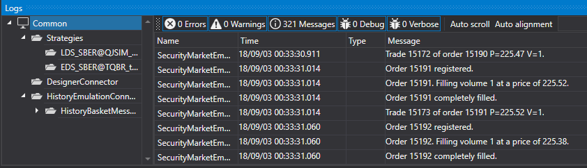

# Extended log panel

[Monitor](../api/StockSharp.Xaml.Monitor.html) \- is the visual element where [LogControl](GUILogControl.md) is used in conjunction with the **TreeView** hierarchical tree, in which logs sources are shown. Initially, the component was designed to monitor the trading strategies. Therefore, by default, the "tree" includes the **Strategy** node. At the same time other sources can be used with this component. 



Sample code

```xaml
\<Window x:Class\="LoggingControls.MainWindow"
        xmlns\="http:\/\/schemas.microsoft.com\/winfx\/2006\/xaml\/presentation"
        xmlns:x\="http:\/\/schemas.microsoft.com\/winfx\/2006\/xaml"
        xmlns:sx\="clr\-namespace:StockSharp.Xaml;assembly\=StockSharp.Xaml"
        Title\="MainWindow" Height\="350" Width\="525"\>
    \<Grid\>
        \<sx:Monitor x:Name\="Monitor" \/\>
    \<\/Grid\>
\<\/Window\>
				
```
```cs
\/\/ creating a new instance of LogManager
\_logManager \= new LogManager();
\/\/ adding .NET traing as a logs source.
\_logManager.Sources.Add(new StockSharp.Logging.TraceSource());
\/\/ adding Monitor as a logs listener.
\_logManager.Listeners.Add(new GuiLogListener(Monitor));
                  
```
