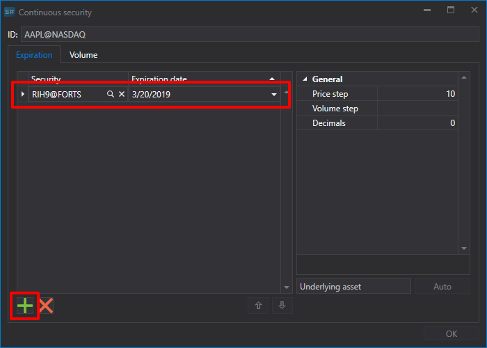

# Continuous futures

[ContinuousSecurityWindow](xref:StockSharp.Xaml.ContinuousSecurityWindow) \- is a visual editor for creating *continuous* ([ContinuousSecurity](xref:StockSharp.Algo.ContinuousSecurity)) instruments. See [Continuous futures](SecurityContinuous.md). 



This component includes: 

- Special [SecurityIdTextBox](xref:StockSharp.Xaml.SecurityIdTextBox) text field, whivh generates a *continuous* instrument with the input of Id \- \[Code\]@\[Board\]. 
- The [SecurityJumpsEditor](xref:StockSharp.Xaml.SecurityJumpsEditor) component is a special DataGrid for working with instruments that are part of a *continuous* instrument. The component instruments are wrapped in the [SecurityJump](xref:StockSharp.Xaml.SecurityJump), class, which has two properties: [Security](xref:StockSharp.Xaml.SecurityJump.Security) and [Date](xref:StockSharp.Xaml.SecurityJump.Date) (roll forward). The added instruments are stored in the [Jumps](xref:StockSharp.Xaml.SecurityJumpsEditor.Jumps). list. The component has the [Validate](xref:StockSharp.Xaml.SecurityJumpsEditor.Validate) function to check the correctness of the component instruments. 
- Buttons for adding\/removing instruments. 
- **Auto** button allows you to automatically create a *continuous* instrument. 
- **Ok** button completes the creation of a *continuous* instrument. 

**Main properties**

- [Security](xref:StockSharp.Xaml.ContinuousSecurityWindow.Security) – continuous instrument
- [SecurityStorage](xref:StockSharp.Xaml.ContinuousSecurityWindow.SecurityStorage) – provider of information about instruments.

Below is the code snippet with its use. 

```cs
private void CreateContinuousSecurity_OnClick(object sender, RoutedEventArgs e)
{
	_continuousSecurityWindow = new ContinuousSecurityWindow
	{
		SecurityStorage = _entityRegistry.Securities,
		Security = new ContinuousSecurity { Board = ExchangeBoard.Associated }
	};
	if (!_continuousSecurityWindow.ShowModal(this))
		return;
	_continuousSecurity = _continuousSecurityWindow.Security;
	ContinuousSecurity.Content = _continuousSecurity.Id;
	var first = _continuousSecurity.InnerSecurities.First();
	var gluingSecurity = new Security
	{
		Id = _continuousSecurity.Id,
		Code = _continuousSecurity.Code,
		Board = ExchangeBoard.Associated,
		Type = _continuousSecurity.Type,
		VolumeStep = first.VolumeStep,
		PriceStep = first.PriceStep,
		ExtensionInfo = new Dictionary<object, object> { { "GluingSecurity", true } }
	};
	if (_entityRegistry.Securities.ReadById(gluingSecurity.Id) == null)
	{
		_entityRegistry.Securities.Save(gluingSecurity);
	}
}
```

## Recommended content

[Continuous futures](HydraGluingData.md)
