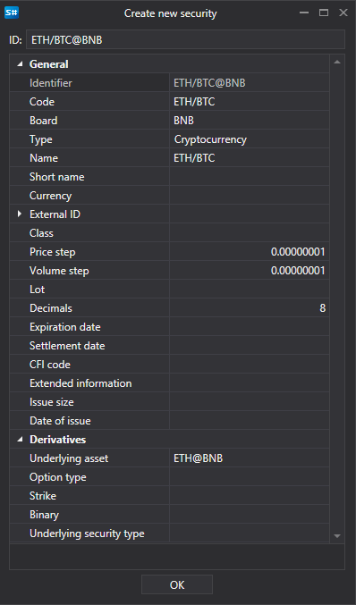

# Window

The [SecurityCreateWindow](../api/StockSharp.Xaml.SecurityCreateWindow.html) component is a window for creating and editing an instrument. The component consists of two main elements: the special text field [SecurityIdTextBox](../api/StockSharp.Xaml.SecurityIdTextBox.html) the property editing grid [PropertyGridEx](../api/StockSharp.Xaml.PropertyGrid.PropertyGridEx.html). You can access the created (edited) instrument with the [Security](../api/StockSharp.Xaml.SecurityCreateWindow.Security.html) property. 

Below is the appearance of the component and the code snippet with its use. 



```cs
private void Button_Click(object sender, RoutedEventArgs e)
{
    var dlg = new SecurityCreateWindow();
    var result = dlg.ShowDialog();
    if (result != null && (bool)result)
    {
        var security = dlg.Security;
    }
}
	
```
