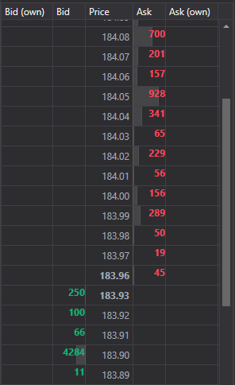

# Order book



[MarketDepthControl](xref:StockSharp.Xaml.MarketDepthControl) \- is a graphical component for displaying an order book. The component allows you to display quotes and own orders. 

**Main properties and methods**

- [MaxDepth](xref:StockSharp.Xaml.MarketDepthControl.MaxDepth) \- the depth of an order book.
- [IsBidsOnTop](xref:StockSharp.Xaml.MarketDepthControl.IsBidsOnTop) \- to display purchases on top.
- [UpdateFormat](xref:StockSharp.Xaml.MarketDepthControl.UpdateFormat(StockSharp.BusinessEntities.Security)) \- to update the format for displaying prices and volumes using the instrument.
- [ProcessOrder](xref:StockSharp.Xaml.MarketDepthControl.ProcessOrder(StockSharp.BusinessEntities.Order,System.Decimal,StockSharp.Messages.OrderStates)) \- to process an order.
- [UpdateDepth](xref:StockSharp.Xaml.MarketDepthControl.UpdateDepth(StockSharp.BusinessEntities.MarketDepth)) \- to refresh an order book.
- [UpdateDepth](xref:StockSharp.Xaml.MarketDepthControl.UpdateDepth(StockSharp.Messages.QuoteChangeMessage)) \- to refresh an order book with a message.

Below is the code snippet with its use. The code example is taken from *Samples\/BarChart\/SampleBarChart*. 

```xaml
<Window x:Class="SampleBarChart.QuotesWindow"
    xmlns="http://schemas.microsoft.com/winfx/2006/xaml/presentation"
    xmlns:x="http://schemas.microsoft.com/winfx/2006/xaml"
    xmlns:xaml="http://schemas.stocksharp.com/xaml"
    Title="QuotesWindow" Height="600" Width="280">
	<xaml:MarketDepthControl x:Name="DepthCtrl" x:FieldModifier="public" />
</Window>
	  				
```
```cs
private void ConnectorOnMarketDepthsChanged(IEnumerable<MarketDepth> depths)
{
	foreach (var depth in depths)
	{
		var wnd = _quotesWindows.TryGetValue(depth.Security);
		if (wnd != null)
			wnd.DepthCtrl.UpdateDepth(depth);
	}
}
	  				
```
